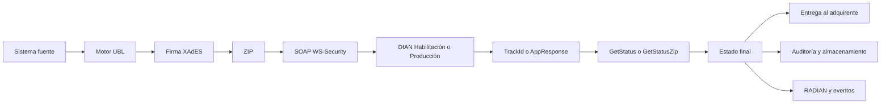
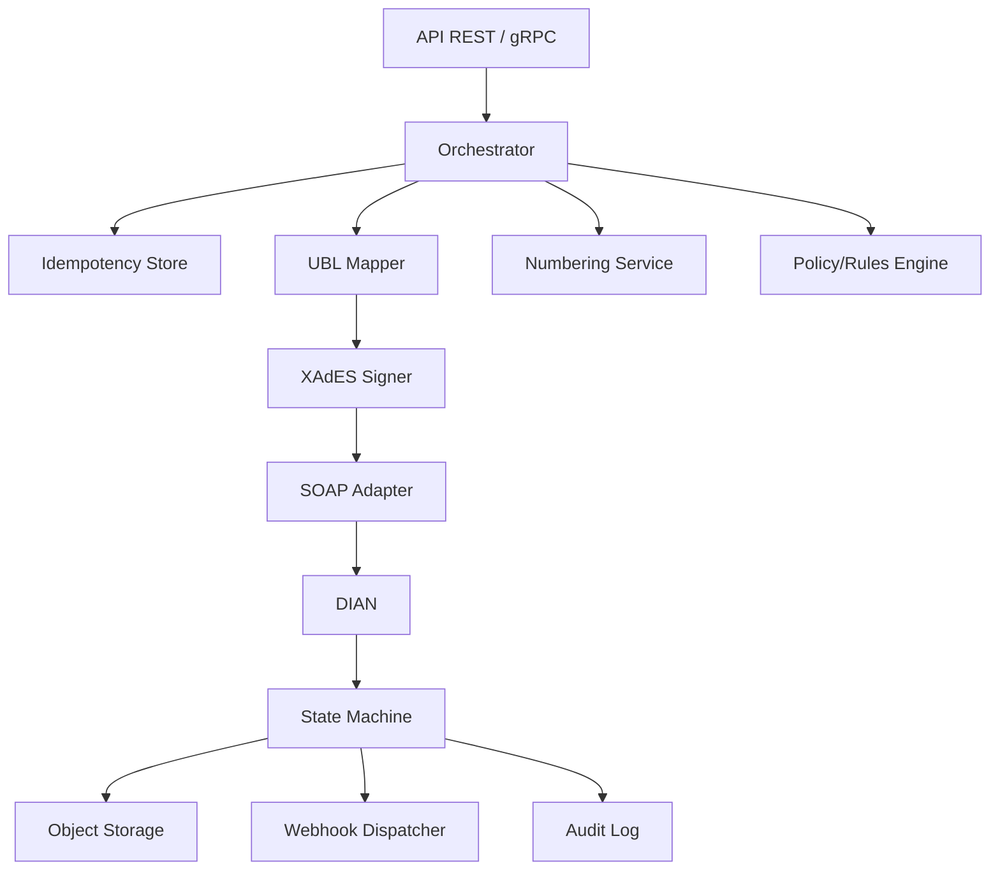

# Arquitectura para una API open source universal de facturación electrónica DIAN en Colombia

## Resumen ejecutivo

Sí es técnicamente viable construir una API open source universal que cubra el núcleo de lo que hoy venden proveedores como Factus, Alegra, Carvajal y Siigo, pero **no** conviene intentar reemplazar todo desde el día uno. Lo razonable es separar el problema en dos capas: una **capa normativa y de interoperabilidad DIAN** que controle UBL 2.1, XAdES, WS-Security, SOAP, ZIP, validación, estados y RADIAN; y una **capa de producto** con REST/gRPC, webhooks, colas, multitenancy, observabilidad, auditoría y SDKs. La primera capa debe ser extremadamente estable, conservadora y testeada contra snapshots XML y simuladores SOAP; la segunda puede evolucionar más rápido. La razón es simple: el principal riesgo no está en “hacer un CRUD de facturas”, sino en sobrevivir a cambios de anexos, validaciones ambiguas, contingencias, numeración, firmas, canonicalización y flujos de recepción/eventos. citeturn9search2turn51view0turn14view0turn16view0turn28view3

La DIAN no obliga a usar un proveedor tecnológico: en habilitación el obligado debe escoger un modo de operación entre **software propio o adquirido**, **servicio gratuito DIAN** o **proveedor tecnológico**. Eso significa que, desde el punto de vista regulatorio, una API open source sí puede operar como “software propio” del facturador, siempre que cumpla habilitación, firma, transmisión, validación, entrega, recepción, conservación y demás anexos técnicos; otra cosa distinta es ser “proveedor tecnológico” autorizado por DIAN, categoría que sí impone requisitos societarios, patrimoniales, ISO 27001, continuidad, PQRSF, personal especializado y verificación formal. citeturn10view1turn14view0

Mi conclusión crítica es esta: **vale la pena construirlo**, pero no como “otro SaaS cerrado” ni como “monolito que hace todo”; vale la pena como **motor universal de cumplimiento** reusable desde cualquier stack. Lo que sí conviene construir desde cero es el **core de dominio**, los **contratos API**, la **capa de idempotencia**, la **orquestación**, el **rastreo normativo**, la **observabilidad** y un **simulador determinista de DIAN**. Lo que conviene **reutilizar** son piezas existentes de generación/firma/plantillas UBL cuando tengan buena cobertura y bajo riesgo, especialmente en PHP, Python y Node, pero encapsuladas detrás de puertos internos para poder reemplazarlas sin romper la plataforma. citeturn49search0turn50view1turn50view2turn50view3turn50view4

## Servicios oficiales DIAN y flujo técnico real

### Qué compone hoy el sistema oficial

La DIAN describe el Sistema de Factura Electrónica como un conjunto de documentos y servicios que incluye, al menos, la **factura electrónica de venta**, el **documento soporte de pago de nómina electrónica**, el **documento soporte en adquisiciones con no obligados a facturar**, los **documentos equivalentes electrónicos** y **RADIAN**. Además, la resolución compilada vigente obliga a que los usuarios del sistema se adapten a los anexos técnicos para habilitación, generación, transmisión, validación, expedición, recepción e interoperabilidad. citeturn34search4turn10view2turn51view0

La habilitación debe hacerse antes de emitir documentos, y en ese proceso el facturador debe registrarse en el servicio de validación previa, informar su correo de recepción, escoger el modo de operación y registrar el software asociado. La propia DIAN enumera tres modos: desarrollo propio o adquirido, software gratuito DIAN y proveedor tecnológico. Para facturadores que van por software propio o proveedor, la DIAN recomienda apoyo técnico para superar el set de pruebas y alcanzar estado habilitado. citeturn10view1turn12view1

### Endpoints y ambientes

Los WSDL públicos de DIAN para el servicio `WcfDianCustomerServices.svc` siguen expuestos en ambientes separados de **habilitación** y **producción**. La guía oficial de consumo de web services además indica que la URL del web service se expone en el catálogo del participante, en el ambiente de habilitación o producción, bajo la opción del facturador. citeturn0search3turn0search16turn16view0

```text
Habilitación
https://vpfe-hab.dian.gov.co/WcfDianCustomerServices.svc?singleWsdl

Producción
https://vpfe.dian.gov.co/WcfDianCustomerServices.svc?singleWsdl
```

Aunque en esta sesión no pude abrir el texto completo del WSDL vivo para listar **cada** operación de forma exhaustiva directamente desde el XML del servicio, sí pude verificar con fuentes oficiales y material técnico DIAN la existencia o uso documentado de estas familias de operaciones:

| Operación o familia | Propósito práctico | Estado de verificación en esta investigación | Evidencia |
|---|---|---|---|
| `GetAcquirer` | Completar datos del adquirente a partir del tipo y número de identificación | Verificada en guía oficial DIAN | citeturn16view0 |
| `GetExchangeEmails` | Consultar correos de recepción registrados; DIAN optimizó su retorno a base64→URL temporal de ZIP/CSV | Verificada en micrositio y comunicado oficial DIAN | citeturn31view2turn32view0 |
| `GetStatus` | Consultar el estado de un documento por identificador de seguimiento o identificador equivalente, según funcionalidad | Verificada en documentación técnica oficial histórica y memorias DIAN | citeturn23search1turn30view1 |
| `GetStatusZip` | Consultar el resultado de envíos tipo test set o ZIP | Verificada en memorias oficiales de nómina electrónica | citeturn30view1 |
| `SendTestSetAsync` | Enviar set de pruebas en habilitación | Verificada en memorias oficiales de nómina electrónica; consistente con set de pruebas de FE | citeturn30view1turn12view1 |
| `SendBillAsync` y `SendBillSync` | Envío de factura electrónica a validación | Verificadas por documentación oficial histórica y ecosistema abierto actual; la enumeración completa en WSDL vivo requiere confirmación final en DIAN | citeturn23search1turn50view2 |
| `SendNominaSync` | Envío síncrono de nómina electrónica | Verificada en memorias oficiales DIAN | citeturn30view1 |
| `SendEventUpdateStatus` / envío de `ApplicationResponse` | Registro de eventos asociados a la factura, especialmente RADIAN | Parcialmente verificada por anexo actual y librerías/repos; conviene confirmarla contra WSDL vivo antes de desarrollar el adaptador final | citeturn20search0turn50view2 |
| `GetNumberingRange` | Consulta programática de rangos de numeración | Muy probable y usada ampliamente en ecosistema DIAN, pero en esta sesión no pude extraer su definición directamente desde el WSDL oficial | citeturn50view2 |

La foto grande del flujo oficial sigue siendo la misma: generar el XML conforme al anexo, firmarlo, empaquetarlo, transmitirlo a DIAN, interpretar la respuesta, consultar el estado y luego entregar al adquirente el XML/representación gráfica/contenedor según corresponda. La resolución compilada define la “transmisión para validación” como el envío a DIAN del ejemplar de información que contendrá factura, notas y demás documentos, y la entrega al adquirente está reglada dependiendo de si este es o no facturador electrónico. citeturn28view3turn27view0

### Flujo técnico operativo

```text
ERP / POS / HIS / Payroll
        |
        v
Normalización interna
        |
        v
Mapeo a UBL 2.1 + DIAN Extensions
        |
        v
Firma XML XAdES-EPES
        |
        v
ZIP payload
        |
        v
SOAP Envelope + WS-Security + WS-Addressing + Timestamp
        |
        v
DIAN WcfDianCustomerServices.svc
        |
        +--> aceptación inmediata / TrackId / ZipKey / AppResponse
        |
        v
GetStatus / GetStatusZip / consultas posteriores
        |
        v
Documento validado / rechazado / notificado
        |
        +--> entrega al adquirente
        +--> almacenamiento XML/PDF/AR/AttachedDocument
        +--> RADIAN / eventos / recepción
```



La DIAN exige además un **correo de recepción** registrado en habilitación. En la práctica de interoperabilidad publicada por la entidad, el intercambio por correo incluye un **ZIP con un `AttachedDocument`** y opcionalmente un PDF de representación gráfica; también se documenta el uso de `GetExchangeEmails` para consultar el correo suministrado por el adquirente y, desde noviembre de 2024, la DIAN optimizó ese método para devolver una URL temporal de descarga de un `.zip` que contiene el `.csv` de correos, con vigencia de 10 segundos. citeturn31view0turn31view2turn32view0

## Marco legal y requisitos técnicos vigentes

### Resoluciones y marco aplicable

La base del sistema actual descansa en la **Resolución 000042 de 2020**, que consolidó la validación previa; la **Resolución 000013 de 2021** para nómina electrónica; la **Resolución 000167 de 2021** para documento soporte con no obligados; la **Resolución 000085 de 2022** para RADIAN y eventos; la **Resolución 000165 de 2023**, que desarrolló el sistema, adoptó el anexo 1.9 de factura electrónica de venta y el anexo 1.0 de documento equivalente electrónico; la **Resolución 000008 de 2024**, que movió plazos; la **Resolución 000119 de 2024**, que ajustó reglas sobre idioma/moneda en representación gráfica; la **Resolución 000189 de 2024**, que hizo ajustes transitorios sobre documentos equivalentes; la **Resolución 000202 de 2025**, que redujo datos exigibles al adquirente; y la **Resolución 000227 de 2025**, que compiló en una resolución única tributaria el régimen aplicable, incluyendo el título del sistema de factura electrónica. En 2026, la **Resolución 000011 de 2026** creó una contingencia transitoria especial de regularización voluntaria con `CustomizationID = 20-REG` y factura tipo `03`. citeturn9search16turn33search1turn33search0turn24search7turn8search17turn8search8turn51view0turn10view3turn29view0

Para arquitectura de producto, el dato más importante es que la compilación de 2025 **no cambió la lógica sustancial** del sistema, pero sí reordenó y concentró las obligaciones. Si construyes una API open source hoy, tu núcleo normativo debe tomar como “fuente de verdad” la resolución compilada 227 de 2025 más sus modificaciones puntuales posteriores, no una mezcla informal de blogs o repos antiguos. citeturn51view0turn29view0

### Software propio, proveedor tecnológico y facturación gratuita

La DIAN permite tres caminos operativos. **Software propio o adquirido**: el obligado desarrolla o compra un software y lo registra en habilitación. **Facturación Gratuita DIAN**: solución de software gratuita de la entidad, con trámite virtual, uso desde internet, sin límite de generación/recepción y posibilidad de solicitar un certificado gratuito de firma digital con vigencia de un año. **Proveedor tecnológico**: un tercero previamente habilitado por DIAN que presta servicios de generación, transmisión, expedición, entrega y recepción. citeturn10view1turn12view0turn34search2

La diferencia estratégica es fuerte. Para operar como software propio basta cumplir el régimen del facturador. Para operar **como proveedor tecnológico DIAN** necesitas, entre otros, sociedad o sucursal en Colombia, RUT, objeto social específico, patrimonio contable de al menos **20.000 UVT** con **10.000 UVT** en propiedad, planta y equipo en Colombia, ISO 27001 o compromiso de aportarla dentro de 18 meses, plan de contingencia, infraestructura acreditada, niveles de servicio, canal PQRSF, personal con conocimientos contables, legales, UBL/XML/XSD y superar verificación de DIAN. citeturn14view0turn13view0turn13view1

### Obligaciones funcionales del facturador

La resolución compilada obliga a que la factura electrónica y los demás documentos del sistema cumplan anexos técnicos, interoperabilidad y funcionalidades para interacción con inventarios, pagos, impuestos indirectos, retenciones y contabilidad. También exige numeración autorizada, cuya vigencia máxima es de **dos años**. citeturn14view0turn27view2

En entrega al adquirente, la DIAN distingue escenarios. Si el adquirente no es facturador electrónico, se puede entregar por correo electrónico o por otro dispositivo que este señale, en formato de representación gráfica; también puede enviarse XML + representación gráfica + documento de validación dentro del contenedor electrónico, o imprimirse la representación gráfica. La propia guía de uso de facturación gratuita recuerda que esa representación gráfica debe incluir un **código QR** que permita consultar el CUFE/UUID en DIAN. citeturn27view0turn24search9turn24search10

La verificación pública por parte del adquirente o tercero se hace con el **CUFE** en el portal de consulta de DIAN. Eso implica que tu API universal no puede tratar el CUFE como un “dato más”: debe ser parte del índice principal de trazabilidad, de la capa de búsqueda y del esquema de almacenamiento. citeturn24search6turn28view3

En contingencia, la compilación indica que si hay inconvenientes tecnológicos del facturador o indisponibilidad del servicio DIAN, el obligado puede seguir facturando bajo las reglas previstas, pero debe transmitir los documentos expedidos durante el inconveniente dentro de las **48 horas** siguientes al restablecimiento del servicio, según corresponda. Ese requisito, por sí solo, justifica diseñar colas persistentes, replay seguro e idempotencia estricta. citeturn28view3

En conservación, la DIAN remite al artículo 632 del Estatuto Tributario, a la Ley 962 y a la Ley 527, y exige que la información conservada sea accesible para consulta posterior. Además, cuando un tercero cumple por cuenta del obligado, ambas partes deben conservar el documento que acredita esa representación. citeturn51view0

### Datos mínimos del adquirente y cambios recientes

La **Resolución 000202 de 2025** redujo y ordenó los datos exigibles al adquirente cuando este pide factura a su nombre: **nombre o razón social**, **tipo y número de identificación** y **correo electrónico**. Si no pide la factura a su nombre, no hay lugar a solicitar esos datos; y cuando entre en operación el servicio de consulta uno a uno que anunció la DIAN, el único dato inicial a solicitar será el número de identificación. La norma además prohíbe usar de forma masiva o distribuir la información obtenida por el servicio de consulta. citeturn10view3

Para una API open source esto tiene consecuencias directas: tu modelo de datos debe minimizar PII, diferenciar claramente facturas a nombre de adquirente vs consumidor final, y no diseñar un “enriquecedor masivo” de compradores. Si haces eso, chocas con la finalidad restringida que definió DIAN para ese servicio. citeturn10view3

### UBL, CUFE, CUDE, `ApplicationResponse`, `AttachedDocument` y firma

La documentación técnica DIAN publicada en su micrositio identifica de forma expresa el **Anexo Técnico de Factura Electrónica de Venta versión 1.9**, su caja de herramientas y la referencia OASIS. Los fragmentos indexados del anexo 1.9 muestran que la base sigue siendo **UBL 2.1**, y que el anexo contempla explícitamente **XAdES** y `ApplicationResponse` / `AttachedDocument`. La compilación 227 de 2025 ratifica la adopción del anexo 1.9 y que las tablas referenciadas viven en la caja de herramientas de DIAN. citeturn30view2turn25search0turn20search0turn23search0turn51view0

La resolución compilada define además el **CUFE** como requisito de la factura electrónica de venta y el **CUDE** como requisito de notas, instrumentos y otros documentos electrónicos del sistema. También define el **contenedor electrónico** como instrumento obligatorio para incluir la información del documento junto con la validación DIAN cuando aplique, y exige que ese instrumento esté firmado digitalmente por el facturador según la política de firma de DIAN. citeturn28view3

Sobre firma y autenticación SOAP, la guía oficial DIAN de consumo de web services exige configurar en SoapUI un **keystore** con el certificado y contraseña, una entrada de **WS-Security Signature**, un **Timestamp** en milisegundos, **autorización básica** y **WS-Addressing** con `wsa:To`. La guía también advierte que en implementaciones propias la cabecera HTTP debe incluir una acción `Content-Type` apropiada; para `GetAcquirer`, por ejemplo, la acción es `http://wcf.dian.colombia/IWcfDianCustomerServices/GetAcquirer`. citeturn16view0

Ese punto es clave: la DIAN no está pidiendo solamente “firmar el XML de negocio”. Está pidiendo dos capas distintas que tu arquitectura debe separar bien: **firma XML del documento UBL** y **seguridad del mensaje SOAP**. Muchas implementaciones fallan porque mezclan ambas responsabilidades o porque asumen que firmar el XML resuelve la autenticación del envelope SOAP. No la resuelve. citeturn25search0turn16view0

## Repositorios open source y comparación con proveedores pagos

### Inventario crítico de repositorios abiertos

La evidencia disponible muestra que sí existe ecosistema abierto reutilizable, pero está fragmentado por lenguaje, antigüedad y alcance. Mi lectura es que hoy **no existe un único repositorio open source universal y maduro** que cubra factura, documentos equivalentes, documento soporte, nómina, recepción, RADIAN, sector salud, operación multiempresa, dashboards, colas, auditoría y mantenimiento normativo continuo. Lo que sí existe son bloques útiles. citeturn50view0turn50view1turn50view2turn50view3turn50view4turn49search4turn49search16

| Repositorio | URL | Lenguaje | Hechos visibles | Faltantes o alertas | Riesgo | Puntuación |
|---|---|---|---|---|---|---|
| `Crispancho93/facturacion-electronica-colombia` | `github.com/Crispancho93/facturacion-electronica-colombia` | Python / FastAPI | API para enviar facturas y notas crédito; README dice que opera en habilitación. citeturn50view0 | No pude verificar en fuentes públicas de esta sesión soporte completo de RADIAN, recepción, salud ni producción. | Medio-alto | 6.5/10 |
| `bit4bit/facho` | `github.com/bit4bit/facho` | Python | Biblioteca para FE Colombia; abstrae XML, crea facturas, firma XML y consulta API DIAN; además tiene CLI. El repo GitHub fue movido a Codeberg. citeturn50view1 | Señal de mantenimiento disperso; licencia visible pero tipo no recuperado en esta sesión. | Medio | 7/10 |
| `soenac/api-dian` | `github.com/soenac/api-dian` | PHP / Laravel | API documentada con Swagger UI, pensada para integrarse con cualquier lenguaje. citeturn50view3 | El repositorio público no me permitió confirmar cobertura actual de anexo 1.9, salud o recepción avanzada. | Medio-alto | 6/10 |
| `diegoasencio96/django-dian` | `github.com/diegoasencio96/django-dian` | Python / Django | Módulo de integración Django con FE DIAN. citeturn50view4 | Solo 2 commits visibles; contenido normativo antiguo habla de UBL 2.0 y Decreto 2242; alto riesgo de desactualización. citeturn50view4 | Alto | 3/10 |
| `Stenfrank/ubl21dian` y espejo `co-ubl21dian` | `github.com/Stenfrank/ubl21dian` / `gitlab.com/torresoftware/ubl21dian` | PHP | Repos históricos valiosos para XAdES, BinarySecurityToken SOAP, canonicalización, CUDE y notas débito/crédito; el historial público marca fixes de canonicalización y licencia LGPL. citeturn49search4turn49search16turn49search20 | Base muy útil, pero antigua para una plataforma completa moderna. | Medio | 7.5/10 como “engine interno”; 4.5/10 como producto final |
| `lopezsoft/ubl21dian` | `github.com/lopezsoft/ubl21dian` | Node.js / TypeScript | Moderniza la librería PHP; declara soporte para XAdES-EPES, WS-Security SOAP, envío de facturas, nómina, eventos, estados, numeración y `GetAcquirer`. citeturn50view2 | No verifiqué releases, licencia y adopción real en producción. | Medio | 8/10 como base Node |
| `dazza-dev/dian-feco` y `Dian-Xml-Generator` | `github.com/dazza-dev/dian-feco` / `github.com/dazza-dev/Dian-Xml-Generator` | PHP | Paquetes orientados a envío de documentos y catálogos DIAN. citeturn49search10turn49search14 | No estaban en tu lista mínima, pero merecen vigilancia; falta ver madurez y mantenimiento. | Medio | 6/10 |

Mi recomendación aquí es concreta: si eliges **Node/TypeScript**, `lopezsoft/ubl21dian` es probablemente el starting point abierto más interesante para encapsular firma, SOAP y operaciones DIAN; si eliges **Python**, `facho` y `facturacion-electronica-colombia` sirven más como referencia y prototipado que como base única de producto; si eliges **PHP**, la familia `ubl21dian/co-ubl21dian` sigue siendo útil para entender detalles de firma, SOAP y canonicalización, pero yo la aislaría detrás de una interfaz propia y la cubriría con pruebas de regresión muy agresivas antes de ponerla en producción. citeturn50view1turn50view0turn50view2turn49search4turn49search16

### Comparación técnica con Factus, Alegra, Siigo y Carvajal

| Proveedor | Documentación pública | Auth/API | Webhooks/Eventos | Rasgos técnicos públicos | Lock-in estimado |
|---|---|---|---|---|---|
| Factus | Fuerte | OAuth2; token de acceso de 1 hora; REST pública con sandbox y producción. citeturn35view0turn35view3turn48search0 | Tiene recepción de documentos y emisión de eventos; la docs públicas muestran secciones de suscripciones y RADIAN. citeturn35view3turn48search1turn48search2 | Rate limit público de 80 req/min por usuario; descarga XML/PDF; soporte a documentos soporte, salud, mandato y transporte. citeturn35view2turn47search12turn34search3 | Medio |
| Alegra | Media en API general; separa “API general” y “Proveedor Electrónico” | API general pública; docs exhiben autenticación y rate-limit, aunque el valor concreto no fue visible en esta sesión. Además existe portal separado “Alegra Proveedor Electrónico” con empresas, sets de pruebas y nómina. citeturn35view1turn40search0turn41view0turn45view0 | Webhooks públicos para facturas, compras, clientes, ítems. citeturn40search2turn40search3turn40search5 | Muy buen alcance ERP/contable; para cumplir DIAN vía proveedor electrónico propio de Alegra, no solo vía API general. citeturn45view0 | Medio-alto |
| Siigo | Fuerte | Token JWT por OAuth-like auth; `Partner-Id` obligatorio; idempotencia nativa por header `Idempotency-Key`. citeturn36search7turn36search2turn36search0 | Webhooks públicos con CRUD de suscripciones. citeturn36search3turn36search1turn36search5 | Batch asíncrono para facturas; cambios públicos para sector salud; bloqueo temporal si durante 7 días la tasa de error supera 80%. citeturn38search0turn36search4 | Medio |
| Carvajal | Baja a nivel developer público recuperado | En las fuentes públicas recuperadas vi páginas comerciales y corporativas, no contratos públicos comparables a Factus o Siigo. citeturn47search1turn47search2 | La oferta pública resalta factura electrónica, POS, documento soporte y documentos equivalentes; no pude verificar webhooks o endpoints técnicos desde material público recuperado aquí. citeturn47search1 | Mucha presencia comercial y comunitaria; menos transparencia técnica pública en esta revisión. citeturn47search2 | Alto |

La lectura competitiva es bastante clara. **Factus** y **Siigo** muestran una superficie API pública mucho más visible para integradores. **Alegra** tiene una dualidad: una API general de negocio, más un producto separado de proveedor electrónico. **Carvajal** sigue siendo un actor muy fuerte de mercado, pero en la evidencia pública recuperada aquí su oferta expone mucho más el discurso de producto que el contrato técnico. Si lo que quieres es evitar vendor lock-in, la oportunidad open source existe precisamente porque la DIAN estandariza el corazón documental, mientras cada proveedor empaqueta conveniencia, soporte y extras alrededor de ese núcleo. citeturn35view0turn45view0turn36search6turn47search1turn47search2

## Diseño propuesto de la API universal

### Principios de diseño

Mi propuesta es construir un **motor de cumplimiento DIAN desacoplado del sistema principal**, expuesto por REST y gRPC, con eventos salientes por webhooks y mensajería asíncrona. Lo importante no es el lenguaje del ERP o POS cliente, sino que la integración externa vea un contrato estable, idempotente y versionado. La resolución compilada exige interoperabilidad y adecuaciones informáticas para habilitación, generación, transmisión, validación, expedición, entrega, recepción y registro, así que el motor debe tratar estas etapas como estados explícitos y auditables, no como efectos secundarios ocultos. citeturn10view2turn51view0

```text
                    ┌─────────────────────────────────────┐
                    │          Public API Gateway         │
                    │ REST / gRPC / Webhooks / CLI / SDKs │
                    └─────────────────────────────────────┘
                                  |
              ┌───────────────────┼───────────────────┐
              |                   |                   |
              v                   v                   v
      Tenant & Auth        Document API        Query / Downloads
              |                   |                   |
              └──────────────┬────┴────┬─────────────┘
                             v         v
                    Orchestrator   Idempotency
                             |         |
                             └────┬────┘
                                  v
                      Rules / Mapping / UBL Engine
                                  |
                     ┌────────────┼────────────┐
                     v            v            v
                  Signer      SOAP Adapter   Local Validators
               XAdES/WSSE       DIAN WSDL     XSD/Rules/CUFE
                     |            |            |
                     └─────┬──────┴──────┬─────┘
                           v             v
                      Outbox/Queue    Object Storage
                           |             |
                           v             v
                    Retry Workers   XML/PDF/AR/ZIP
                           |
                           v
                      DIAN + RADIAN
```



### Componentes mínimos

El sistema que realmente compite con proveedores pagos necesita, como mínimo, estos servicios internos:

| Componente | Responsabilidad |
|---|---|
| `tenant-service` | empresas, usuarios, roles, ambientes, aislamiento multiempresa |
| `certificate-service` | carga de `.p12/.pfx`, rotación, cifrado, metadatos, expiración |
| `numbering-service` | resoluciones, prefijos, consecutivos, rangos, bloqueo seguro |
| `document-service` | crear factura, nota, documento soporte, nómina, equivalentes |
| `ubl-service` | mapping del modelo canónico a UBL 2.1 + DIAN Extensions |
| `signature-service` | firma XAdES del XML y firma/seguridad SOAP |
| `dian-gateway` | adaptador SOAP/WSDL por ambiente y operación |
| `status-service` | polling, reconciliación, lectura de `ApplicationResponse` |
| `delivery-service` | email, ZIP, `AttachedDocument`, PDF, reenvíos |
| `reception-service` | recepción y eventos RADIAN, buzones y `GetExchangeEmails` |
| `storage-service` | XML, PDF, AR, SOAP envelopes, ZIP, evidencias |
| `audit-service` | trazabilidad completa de cambios, accesos y decisiones |
| `rules-service` | catálogos, XSD, reglas activas, CUFE/CUDE/CUNE/CUDS |
| `webhook-service` | suscripción, firma, reintentos, DLQ |
| `ops-console` | soporte, replay, búsqueda por CUFE, TrackId, ZIP, NIT, prefijo |

### Contratos REST propuestos

Los ejemplos siguientes son **propuesta de diseño**, no endpoints DIAN. El objetivo es encapsular la complejidad SOAP/XML detrás de un contrato estable.

#### Crear empresa

```json
POST /v1/companies
{
  "tenant_id": "tn_01J...",
  "legal_name": "Clinica Ejemplo SAS",
  "nit": "900123456",
  "dv": "7",
  "environment": "sandbox",
  "operation_mode": "SOFTWARE_PROPIO",
  "reception_email": "fe@clinica-ejemplo.com",
  "country_code": "CO",
  "currency_code": "COP"
}
```

#### Registrar certificado

```json
POST /v1/certificates
{
  "company_id": "cmp_01J...",
  "format": "P12",
  "password_secret_ref": "vault://certs/cmp_01J/main",
  "base64_file": "MIIK..."
}
```

#### Registrar resolución y numeración

```json
POST /v1/numbering-ranges
{
  "company_id": "cmp_01J...",
  "document_type": "INVOICE",
  "prefix": "FE",
  "from_number": 1,
  "to_number": 500000,
  "current_number": 18502,
  "resolution_number": "18764000001",
  "valid_from": "2026-01-01",
  "valid_to": "2027-12-31",
  "technical_key_secret_ref": "vault://dian/cmp_01J/fe-tech-key"
}
```

#### Crear factura

```json
POST /v1/invoices
{
  "idempotency_key": "erp-INV-2026-00018258",
  "company_id": "cmp_01J...",
  "document": {
    "issue_date": "2026-05-22",
    "issue_time": "13:45:12-05:00",
    "invoice_type_code": "01",
    "operation_type": "10",
    "currency_code": "COP",
    "customer": {
      "identification_type": "31",
      "identification_number": "900999888",
      "dv": "5",
      "legal_name": "Aseguradora Ejemplo SA",
      "email": "recepcion@aseguradora.com"
    },
    "payment": {
      "payment_form": "1",
      "payment_method": "10"
    },
    "lines": [
      {
        "code": "SERV-001",
        "description": "Consulta externa",
        "quantity": "1.00",
        "unit_code": "NIU",
        "unit_price": "100000.00",
        "taxes": [
          {
            "code": "01",
            "percent": "19.00",
            "taxable_amount": "100000.00",
            "tax_amount": "19000.00"
          }
        ]
      }
    ]
  },
  "options": {
    "generate_pdf": true,
    "deliver_to_customer": true,
    "sync_with_dian": false
  }
}
```

#### Respuesta

```json
202 Accepted
{
  "document_id": "doc_01J...",
  "status": "QUEUED",
  "next_action": "SIGN_AND_SEND",
  "tracking": {
    "internal_trace_id": "trc_01J...",
    "idempotency_key": "erp-INV-2026-00018258"
  }
}
```

#### Consultar estado

```json
GET /v1/documents/doc_01J...
{
  "document_id": "doc_01J...",
  "type": "INVOICE",
  "status": "DIAN_ACCEPTED",
  "dian": {
    "track_id": "2db8b0b0-...",
    "cufe": "7b0db3...",
    "validation_message": "Documento validado por la DIAN"
  },
  "artifacts": {
    "xml_url": "/v1/documents/doc_01J.../xml",
    "pdf_url": "/v1/documents/doc_01J.../pdf",
    "application_response_url": "/v1/documents/doc_01J.../application-response"
  }
}
```

#### Emitir evento RADIAN

```json
POST /v1/receptions/invoices/{document_id}/events
{
  "event_code": "030",
  "actor": {
    "identification_type": "13",
    "identification_number": "1012345678",
    "first_name": "Ana",
    "last_name": "Perez",
    "job_title": "Coordinadora de compras",
    "organization_department": "Abastecimiento"
  }
}
```

#### Error contract

```json
409 Conflict
{
  "error": {
    "code": "IDEMPOTENCY_CONFLICT",
    "message": "Ya existe un documento asociado a esa llave de idempotencia",
    "details": {
      "document_id": "doc_01J..."
    }
  }
}
```

```json
422 Unprocessable Entity
{
  "error": {
    "code": "UBL_MAPPING_ERROR",
    "message": "El documento no cumple las reglas mínimas para generar XML UBL 2.1",
    "details": [
      {"field": "customer.email", "reason": "required_for_selected_delivery_mode"},
      {"field": "lines[0].unit_code", "reason": "invalid_dian_catalog_code"}
    ]
  }
}
```

### Modelo de datos recomendado

La resolución compilada obliga a conservar documentos, soportes y trazabilidad; la DIAN además basa buena parte de su control en numeración, CUFE/CUDE, correos de recepción, contenedor y validación. Por eso el modelo debe estar orientado a **auditoría de hechos**, no solo a tablas maestras. citeturn51view0turn28view3turn31view2

| Entidad | Campos esenciales |
|---|---|
| `tenants` | `id`, `name`, `status`, `plan`, `created_at` |
| `companies` | `id`, `tenant_id`, `nit`, `dv`, `legal_name`, `environment`, `operation_mode`, `reception_email` |
| `users` | `id`, `tenant_id`, `email`, `status` |
| `roles_permissions` | RBAC/OIDC scopes |
| `certificates` | `id`, `company_id`, `thumbprint`, `subject`, `valid_from`, `valid_to`, `kms_ref`, `status` |
| `numbering_ranges` | `id`, `company_id`, `document_type`, `prefix`, `resolution_number`, `from_no`, `to_no`, `current_no`, `valid_from`, `valid_to`, `technical_key_ref` |
| `customers` | `id`, `company_id`, `identification_type`, `identification_number`, `dv`, `name`, `email` |
| `documents` | `id`, `company_id`, `type`, `environment`, `prefix`, `number`, `issue_date`, `issue_time`, `status`, `currency`, `payable_amount`, `dian_track_id`, `cufe_cude` |
| `document_lines` | `document_id`, `line_no`, `code`, `description`, `qty`, `unit_code`, `unit_price`, `line_extension_amount` |
| `document_taxes` | `document_id`, `scope`, `line_no`, `tax_code`, `percent`, `taxable_base`, `tax_amount` |
| `document_allowances` | descuentos/recargos globales y por línea |
| `payments` | `document_id`, `payment_form`, `payment_method`, `due_date`, `amount` |
| `xml_artifacts` | `document_id`, `kind`, `sha256`, `storage_uri`, `schema_version` |
| `soap_messages` | `document_id`, `operation`, `request_xml_uri`, `response_xml_uri`, `http_status`, `soap_action`, `latency_ms` |
| `dian_status_history` | `document_id`, `status`, `code`, `message`, `raw_payload_uri`, `timestamp` |
| `events_radian` | `document_id`, `event_code`, `event_status`, `event_cude`, `actor_snapshot` |
| `webhook_subscriptions` | `tenant_id`, `topic`, `url`, `secret_ref`, `status` |
| `webhook_deliveries` | `subscription_id`, `event_id`, `attempts`, `last_status`, `next_retry_at` |
| `idempotency_keys` | `scope`, `key`, `resource_type`, `resource_id`, `request_hash`, `expires_at` |
| `audit_logs` | `actor`, `action`, `resource`, `diff`, `ip`, `ts` |

Mi recomendación es que `documents`, `events_radian`, `soap_messages`, `xml_artifacts` e `idempotency_keys` sean el corazón transaccional; y que el resto pueda cambiar sin romper la trazabilidad. Si no modelas desde el comienzo los envelopes SOAP, los ZIP enviados, los `ApplicationResponse` y los estados históricos, la mesa de soporte te va a explotar a los tres meses. Esa es una de las diferencias reales entre un proyecto hobby y una plataforma que reemplaza proveedores pagos. citeturn16view0turn31view0turn24search6

## Seguridad, rendimiento, testing, roadmap y conclusión

### Estrategia de seguridad

La seguridad mínima de una plataforma así tiene dos capas: **seguridad tributaria-documental** y **seguridad de plataforma**. En la primera, debes proteger certificados `.p12/.pfx`, claves técnicas de numeración, XML firmados, `ApplicationResponse`, SOAP envelopes y cualquier evidencia de entrega. En la segunda, necesitas OAuth2/OIDC, JWT de corta duración, RBAC por tenant/empresa, rate limiting, rotación de secretos, cifrado en reposo, auditoría inmutable, backups, hardening de colas y controles de supply chain. La propia DIAN ya eleva la barra cuando exige ISO 27001, continuidad, PQRSF y pruebas tecnológicas a proveedores tecnológicos, y además publicó lineamientos de desarrollo de software donde menciona análisis estático/dinámico y dependencias. citeturn14view0turn49search23

Mi diseño recomendado es:

| Tema | Recomendación |
|---|---|
| Certificados | Nunca guardar `.p12/.pfx` en base de datos en claro; usar Vault/KMS/HSM o cifrado envelope con rotación |
| Secretos DIAN | `technical_key`, passwords de certificados y credenciales por empresa en secretos externos |
| Identidad | Keycloak, Auth0 o Entra ID para OIDC; JWT internos cortos y scopes finos |
| Aislamiento | `tenant_id` obligatorio en toda consulta; RLS en PostgreSQL si aplica |
| Auditoría | append-only + hash chain para eventos críticos |
| Webhooks | firma HMAC + timestamp + nonce + retries con DLQ |
| XML | parser seguro, sin entidades externas, sin expansion attacks |
| Supply chain | SBOM, SAST, DAST, dependency scanning, provenance de imágenes |
| Backups | XML/PDF/AR/ZIP en storage versionado + checksum y restore drills |

### Rendimiento, concurrencia e idempotencia

La DIAN no opera como una API moderna de baja latencia y semántica completamente clara; por eso tu sistema no debe acoplar la respuesta del usuario final a la validación remota, salvo excepciones. Lo correcto es usar **colas** y **workers**, dejar síncrono solo el “acepté tu solicitud”, y procesar firma/envío/consulta por detrás. Esto además te protege cuando aplican contingencias, cuando debes retransmitir dentro de 48 horas, o cuando el polling de estado tarda más de lo esperado. citeturn28view3turn16view0

La regla de oro es esta:

```text
idempotency_key por documento de negocio
+ lock transaccional por rango de numeración
+ outbox pattern
+ retries exponenciales con jitter
+ circuit breaker al gateway SOAP
+ DLQ para documentos ambiguos
= plataforma que sobrevive a la DIAN real
```

Pseudocódigo de emisión segura:

```text
function submitInvoice(command):
    assertUnique(command.idempotency_key)
    validateBusinessRules(command)
    reserveSequentialNumber(command.company_id, command.document_type)
    persistDocument(status="QUEUED")
    publishOutbox("document.to_sign_and_send")
    return accepted(document_id)

worker signAndSend(document_id):
    xml = mapToUBL(document_id)
    signed_xml = sign(xml)
    zip = pack(signed_xml)
    soap = buildEnvelope(zip)
    response = callDian(soap)
    persistSoap(response)
    transitionState(document_id, response)

worker reconcile(document_id):
    if state in ["TRACK_ID_PENDING", "ZIP_PENDING"]:
        status = queryStatus(document_id)
        persistStatus(status)
        if final(status):
            dispatchWebhooks(document_id)
```

Si el documento de negocio puede venir duplicado desde ERP, POS, e-commerce o HIS, la llave de idempotencia debe ser externa, visible y obligatoria. Aquí Siigo da una lección útil: su API publica un `Idempotency-Key` para POST de comprobantes, precisamente para permitir reintentos seguros. En una plataforma open source que quiera reemplazar proveedores serios, ese nivel de disciplina no es opcional. citeturn36search0

### Testing, observabilidad y CI/CD

La estrategia de calidad debe parecerse más a la de un gateway financiero que a la de una app administrativa:

| Tipo de prueba | Objetivo |
|---|---|
| Unit | mapeos, reglas locales, cálculo CUFE/CUDE/CUNE/CUDS, numeración |
| Snapshot XML | congelar XML válidos por versión/anexo/sector |
| XSD validation | validar estructura antes de firmar |
| Signature tests | verificar digest, reference URIs, transforms, canonicalization |
| SOAP contract tests | comparar envelope y headers esperados |
| DIAN simulator | respuestas normales, ambiguas, timeouts, errores SOAP, estados parciales |
| Concurrency tests | carrera en numeración, replay, idempotencia |
| Regression normativa | catálogos, cambios de anexo, nuevas reglas activas |
| Load tests | throughput por tenant, latency por firma, stress de colas |
| Chaos tests | caída de storage, latencia SOAP, expiración de certificados |

En observabilidad, yo no construiría esto sin `OpenTelemetry`, métricas Prometheus, dashboards Grafana y logs estructurados con correlación `tenant_id`, `company_id`, `document_id`, `track_id`, `cufe/cude`, `operation`, `soap_action`, `attempt`. También necesitas indicadores de negocio: tasa de rechazo por regla, tiempo a validación, latencia por operación DIAN, fallas por certificado, backlog por tenant y replay success rate. Factus y Siigo exponen públicamente conceptos como rate limiting, headers, webhooks e idempotencia; una alternativa open source debe alcanzar al menos ese nivel de visibilidad operativa, aunque sea en self-hosted. citeturn35view2turn36search0turn36search3

### Tecnologías con visión de largo plazo

Mi recomendación, pensando a 20 años, no es casarte con un solo lenguaje sino con una arquitectura. Aun así, si tuviera que escoger hoy:

| Capa | Recomendación |
|---|---|
| Core normativo y firma | **Java/Kotlin** o **Go** si priorizas robustez operativa; **Rust** si tu equipo domina sistemas y seguridad; **Node/TypeScript** si quieres velocidad de equipo y reutilizar `dian-sdk-node` |
| API pública | REST con OpenAPI 3.1 + gRPC interno |
| Orquestación | Temporal o motores de workflow equivalentes |
| Base de datos | PostgreSQL |
| Cache / locks | Redis |
| Mensajería | RabbitMQ o NATS JetStream; Kafka si necesitas escala analítica/publish-subscribe compleja |
| Storage | S3/MinIO |
| Seguridad | Vault + Keycloak |
| Observabilidad | OpenTelemetry + Prometheus + Grafana + Loki |
| Deploy | Docker + Kubernetes |
| Arquitectura | Hexagonal + Clean Architecture; CQRS solo donde aporte; Event Sourcing selectivo, no dogmático |

Mi opinión fuerte aquí es esta: **no** haría el core de firma/UBL/SOAP como un Laravel monolítico si el objetivo es ser “infraestructura universal”; Laravel puede ser excelente para paneles, onboarding y backoffice, pero para el núcleo de interoperabilidad DIAN yo privilegiaría un servicio más estricto, con tipado fuerte, colas y tests de contrato muy duros. PHP sigue siendo útil para reutilizar librerías existentes, pero no lo escogería como único pilar de la plataforma futura salvo que tu equipo tenga una ventaja enorme allí. citeturn50view2turn50view3turn50view1

### Roadmap por fases

| Fase | Alcance |
|---|---|
| Fase inicial | multitenancy, empresas, certificados, numeración, facturas FEV, notas crédito, XML local, firma, envío DIAN, estados, XML/PDF, webhooks básicos |
| Fase de cumplimiento | notas débito, documento soporte, attached document, correo de recepción, búsqueda por CUFE, replay y auditoría |
| Fase de recepción | buzón de recepción, consulta de correos, carga de facturas recibidas, eventos RADIAN 030/031/032/033/034 |
| Fase documental ampliada | nómina electrónica, documentos equivalentes electrónicos, health op types, plantillas sectoriales |
| Fase enterprise | HA, particionamiento, métricas de negocio, autoscaling, portal operador, CLI, SDKs oficiales, migraciones normativas automatizadas |
| Fase ecosistema | marketplace de conectores ERP/POS/HIS, simulador DIAN open source, suite de certificación comunitaria |

### Riesgos reales y mitigaciones

| Riesgo | Impacto | Mitigación |
|---|---|---|
| Cambios normativos frecuentes | Alto | equipo o célula de “normative ops”, catálogos versionados, regression pack por anexo |
| Canonicalización / namespaces / firma | Alto | snapshots, tests de signature, librería encapsulada, no tocar XML firmado |
| Caídas/timeouts DIAN | Alto | colas, circuit breaker, retries con jitter, replay seguro, dashboards de contingencia |
| Numeración concurrente | Alto | locks estrictos, reserva transaccional, monotonicidad por rango |
| Certificados vencidos o mal cargados | Alto | monitoreo proactivo, alertas, validación previa al envío |
| Ambigüedad de errores SOAP | Alto | clasificación de errores, almacenamiento integral de request/response, consola de soporte |
| PII y uso indebido del servicio de consulta de adquirente | Alto | minimización de datos, control uno a uno, auditoría de acceso |
| Vendor lock-in interno | Medio | puertos/adaptadores, no acoplar dominio a una librería open source externa |
| Mantenimiento OSS discontinuo | Medio | forks propios, contrato interno estable, suite de compliance propia |
| Responsabilidad tributaria del usuario final | Alto | términos claros, evidencias completas, trazabilidad y separación entre software y acto del obligado |

### Conclusión crítica

Construir una API open source universal para DIAN **sí vale la pena**, pero con una tesis muy específica: no competir primero por marketing o UX, sino por **correctitud, trazabilidad y portabilidad**. La oportunidad existe porque DIAN define el estándar documental y porque el mercado todavía obliga a muchos equipos a depender de capas cerradas para cosas que, técnicamente, podrían resolverse de forma abierta y reusable. citeturn10view1turn51view0turn35view0turn36search6

Si yo tuviera que priorizar qué construir y qué reutilizar, haría esto:

| Construir desde cero | Reutilizar o adaptar |
|---|---|
| modelo canónico de documentos | plantillas UBL existentes |
| orquestador y state machine | motores/forks de firma XAdES existentes |
| idempotencia, outbox y reintentos | clientes SOAP DIAN ya probados |
| multiempresa, seguridad, auditoría, observabilidad | catálogos y validadores comunitarios |
| API REST/gRPC y SDKs | partes de `facho`, `ubl21dian`, `dian-sdk-node` según stack |
| simulador DIAN y regression suite | ejemplos de comunidad para casos edge |

La pieza más valiosa del proyecto no será “emitir una factura”, porque eso ya lo hacen muchos. La pieza valiosa será un **núcleo open source verificable**, con **contratos estables**, **certificación reproducible**, **migraciones normativas controladas** y **capacidad de operar como software propio**, sin obligar a cada empresa a reescribir UBL 2.1, XAdES, WS-Security y SOAP desde cero. Si logras eso, no solo reemplazas técnicamente a proveedores pagos en muchos escenarios: también creas una base reusable para cualquier proyecto, sin importar la tecnología del sistema principal. citeturn10view1turn16view0turn25search0turn50view2turn50view1

### Preguntas abiertas y limitaciones

En esta investigación quedaron algunos puntos que **conviene confirmar directamente contra la DIAN** antes de cerrar una implementación productiva:

| Punto | Estado |
|---|---|
| Lista exhaustiva de operaciones del WSDL vivo actual en habilitación y producción | No pude extraer el XML completo del WSDL en esta sesión; confirmé familias clave, pero no la enumeración completa con tipos |
| Detalle completo de campos obligatorios del sector salud en el anexo 1.9 oficial | Confirmé la existencia pública de tipos de operación en ecosistema y cambios de proveedores, pero el PDF oficial no se dejó abrir completo aquí |
| Contratos técnicos públicos de Carvajal comparables a los de Factus/Siigo | No encontré en las fuentes recuperadas un portal developer equivalente |
| Licencia exacta y actividad reciente de todos los repos open source listados | En algunos casos solo pude ver parte del README o actividad visible, no la ficha completa del repositorio |

Aun con esas limitaciones, la base para decidir arquitectura ya es sólida: **la viabilidad técnica es alta, la complejidad operativa es muy alta, y la clave del éxito está en diseñar un core normativo pequeño, reemplazable y brutalmente testeado**. citeturn51view0turn16view0turn14view0